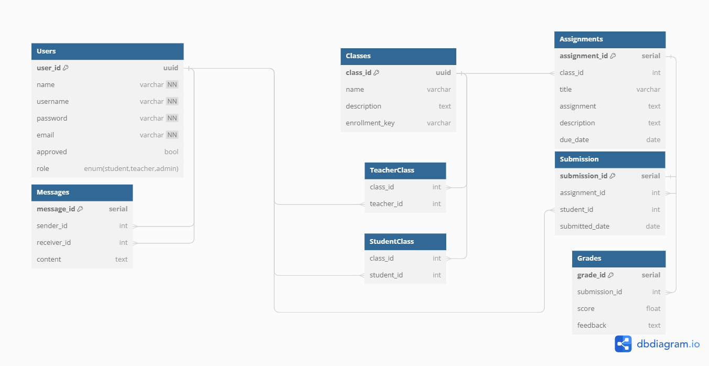
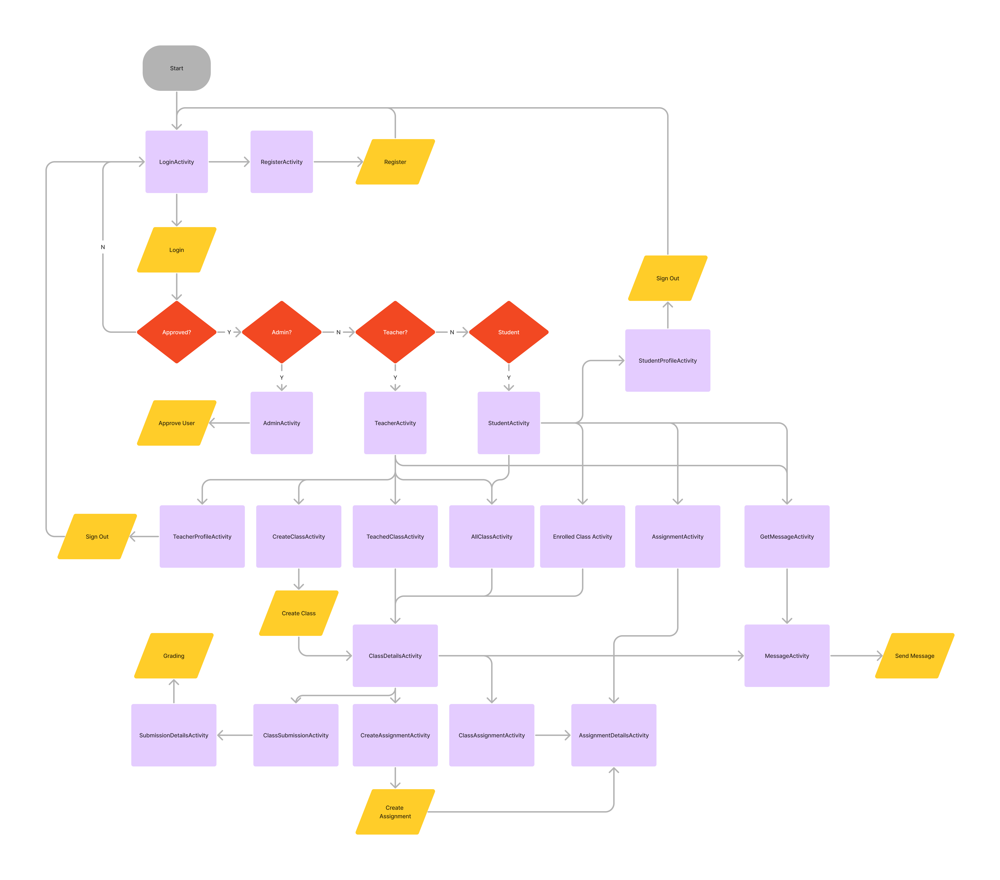
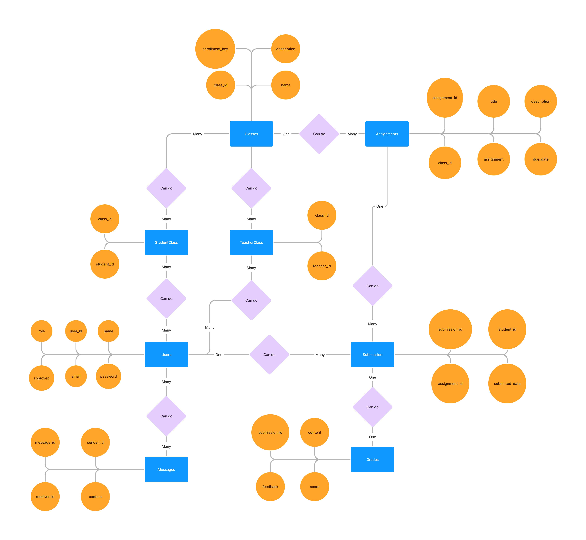

# ClassConnect Mobile App

ClassConnect Mobile App is a learning application designed to facilitate interaction between teachers and students. This app allows users to manage classes, assign and collect assignments, view grades, and provide feedback. With an intuitive and user-friendly interface, ClassConnect aims to support the learning process effectively and efficiently.

## Postman Documentation
[](https://documenter.getpostman.com/view/30137209/2sA3XLG56x)

## Diagrams
### UML


### Flowchart


### ERD


## Key Features
### Teachers
- **Create Class**: This feature allows users to create new classes, entering information such as class name and description.
- **Give Assignments**: Teachers can create and upload assignments for students. Information such as the assignment title, description, and due date can be entered.
- **View and Grade Assignments**: Teachers can view assignments submitted by students, grade them, and provide feedback.
- **View Class Members**: Teachers can see a list of students enrolled in their classes.

### Students
- **Enroll to Class**: Students can join a class using the registration key provided by the teacher.
- **Submit Assignments**: Students can upload their assignments to be graded by the teacher.
- **Check Grade and Feedback**: Students can view the grades and feedback provided by the teacher for submitted assignments.
- **View Class Members**: Students can see a list of class members and send messages to them.

## Installation

1. Clone this repository to your local machine.
    ```bash
    git clone https://github.com/NargaFRZ/ClassConnect
    ```

2. Install the API by navigating to the ClassConnect-API folder in one terminal
    ```bash
    cd ClassConnect-API
    ```

3. Install all dependencies
    ```bash
    npm install
    ```

4. Run the Backend server
    ```bash
    node index
    ```

5. For the Frontend, open the project through Android Studio
6. Ensure you have the necessary dependencies and SDKs required to run this app.
7. Connect an Android device or use an emulator to run the app.

## Usage

1. Open the ClassConnect app on your Android device.
2. Follow the instructions for each feature and enter the required information.
3. The app will provide notifications or success/error messages related to the transactions performed.
4. Use the navigation menu or back button to switch between available features.

## Contribution

Contributions to the development and improvement of this app are greatly appreciated. If you want to contribute, follow these steps:

1. Fork this repository.
2. Create a new branch for the feature or fix you want to work on.
3. Make the necessary changes.
4. Submit a pull request explaining the details of the changes you made.

## Development Team

- Fairuz Muhammad - [Github](https://github.com/NargaFRZ)

## License

This project is licensed under the [MIT License](LICENSE). Please refer to the LICENSE file for more information.

---

By using ClassConnect Mobile App, you can easily manage the learning process and interact with students effectively. Experience the ease and convenience!
